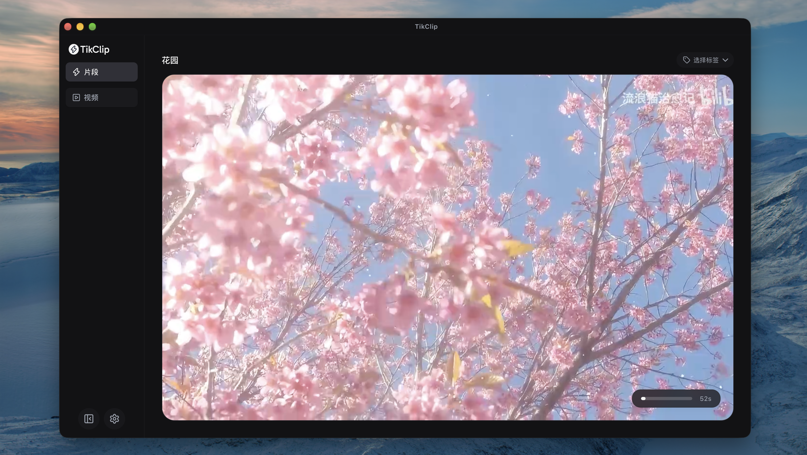

<div align="center">
  <br>
  <h3 align="center">
    <p align="center"></p>
    <br>
   TikClip - 一个优雅的本地视频播放器，精选片段，通过随机视频流播放
  </h3><br>
  多语言，深浅色主题，缩略图，更多功能开发中...
</div>

# 使用教程

## 1. 安装

```bash
git clone
npm i
npm run dev
```

## 2. 使用

启动项目后在浏览器打开，点击设置，选择文件夹并授予权限，即可在视频页面看到已有视频。<br>
**注意，每个视频需要单独文件夹存放，否则无法识别** ，同目录下可以存放图片，默认识别为封面。
